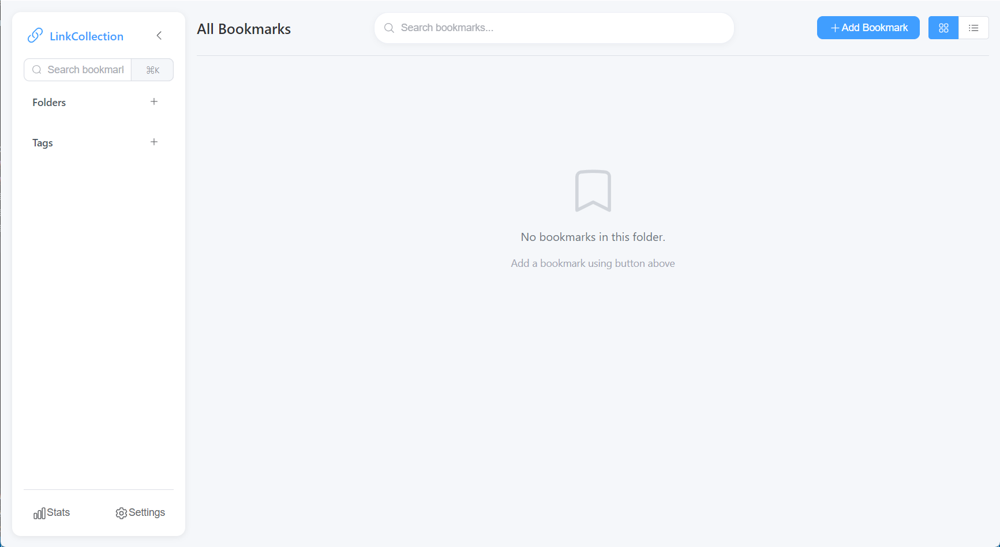
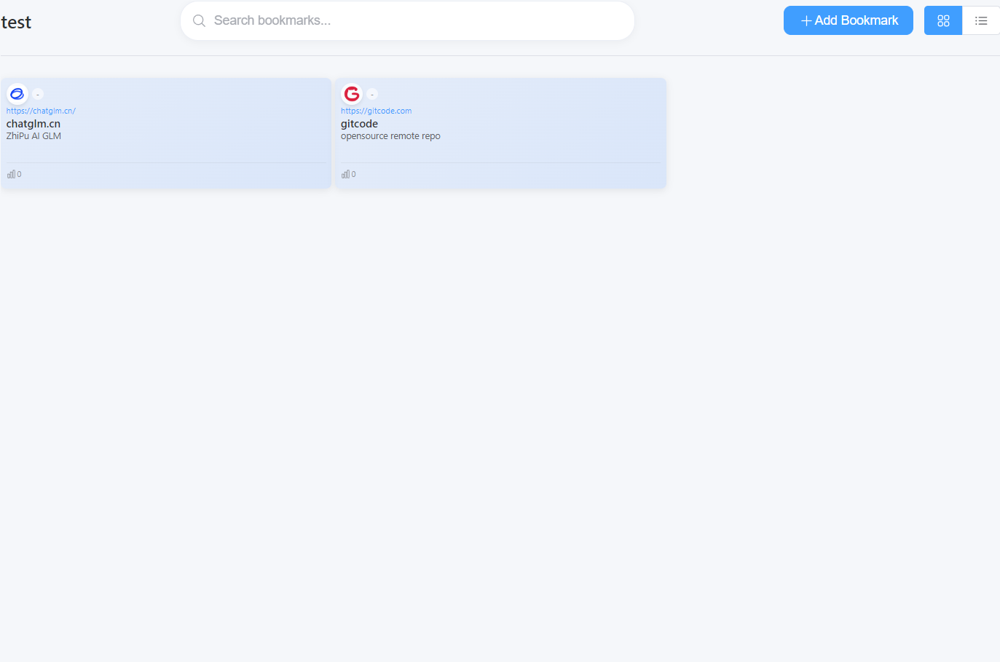
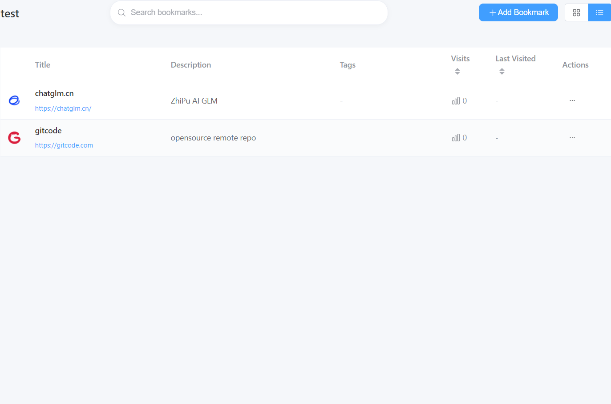
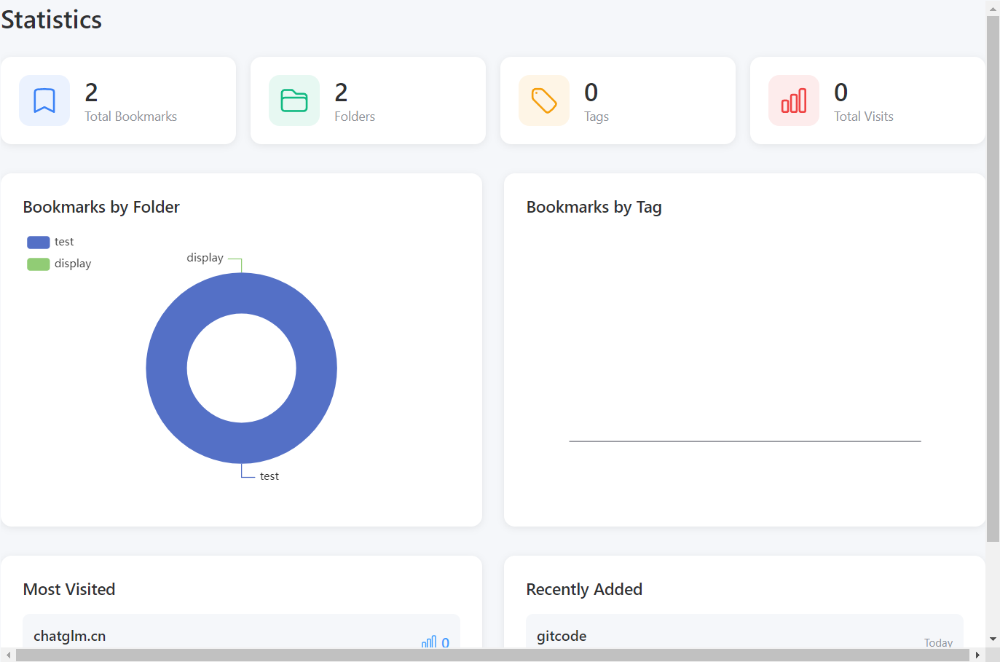
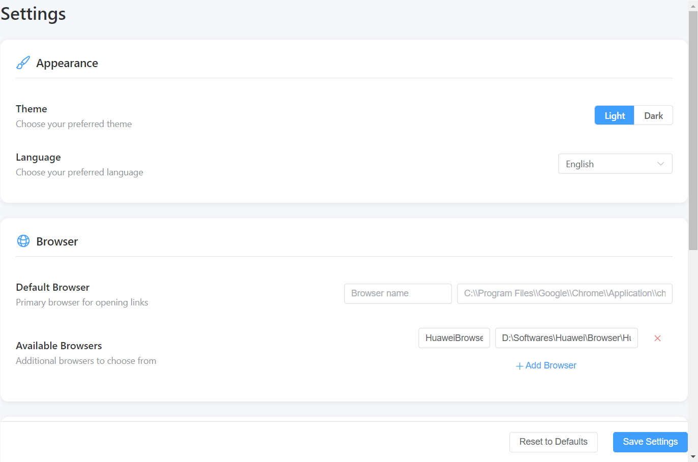

# LinkCollection

<div align="center">


**一个现代化的跨平台书签管理应用**

[功能特性](#功能特性) • [快速开始](#快速开始) • [截图](#截图) • [开发指南](#开发指南) • [贡献指南](#贡献指南)

</div>

---

## ✨ 功能特性

### 📚 书签管理

- **多文件夹组织** - 创建文件夹分类管理书签
- **标签系统** - 使用标签快速筛选和分类
- **双视图模式** - 卡片视图和列表视图自由切换
- **智能搜索** - 支持标题、URL、描述全文搜索
- **快速访问** - 一键打开书签，支持多浏览器选择
- **访问统计** - 记录访问次数和最后访问时间

### 🎨 界面设计

- **现代化 UI** - 基于 Element Plus 的精美界面
- **响应式布局** - 适配不同屏幕尺寸
- **深色主题** - 支持深色/浅色主题切换
- **自定义颜色** - 书签卡片支持自定义颜色
- **Favicon 自动获取** - 自动获取网站图标，加载失败时显示默认图标

### 📊 数据统计

- **实时统计** - 总书签数、总文件夹数、总标签数
- **访问分析** - 按文件夹统计书签分布
- **可视化图表** - 使用 ECharts 展示数据

### ⚙️ 设置管理

- **浏览器配置** - 配置默认浏览器和备用浏览器
- **语言切换** - 支持中文和英文界面
- **主题设置** - 一键切换深色/浅色主题
- **图标获取** - 自动获取网站图标开关
- **数据管理** - 一键清空所有数据

### 🔒 安全性

- **Content Security Policy (CSP)** - 配置了严格的安全策略
- **上下文隔离** - 启用 Electron 上下文隔离
- **禁用 Node Integration** - 渲染进程禁用 Node.js 集成

---

## 🚀 快速开始

### 环境要求

- **Node.js**: v18 或更高版本
- **npm**: v8 或更高版本
- **操作系统**: Windows 10+, macOS 10.15+, Linux

### 安装

```bash
# 克隆仓库
git clone https://gitcode.com/EthanCheung/LinkCollections
cd LinkCollections

# 安装依赖
npm install
```

### 开发模式

```bash
# 启动 Electron 开发服务器
npm run dev

# 仅启动 Web 开发服务器
npm run dev:web
```

### 构建

```bash
# 构建生产版本
npm run build

# 构建 Windows 安装包
npm run build:win
```

构建产物将输出到 `release/1.0.0/` 目录。

---

## 📸 截图

### 主界面



### 卡片视图



### 列表视图



### 统计页面



### 设置页面



---

## 🛠️ 技术栈

### 核心框架

- **[Electron](https://www.electronjs.org/)** - 跨平台桌面应用框架
- **[Vue 3](https://vuejs.org/)** - 渐进式 JavaScript 框架
- **[TypeScript](https://www.typescriptlang.org/)** - JavaScript 的超集
- **[Vite](https://vitejs.dev/)** - 新一代前端构建工具

### UI & 样式

- **[Element Plus](https://element-plus.org/)** - Vue 3 组件库
- **[UnoCSS](https://unocss.dev/)** - 即时原子化 CSS 引擎
- **[Heroicons](https://heroicons.com/)** - 优美的 SVG 图标库

### 状态管理 & 数据

- **[Pinia](https://pinia.vuejs.org/)** - Vue 状态管理库
- **[ECharts](https://echarts.apache.org/)** - 数据可视化图表库
- **[Node-vibrant](https://jariz.github.io/node-vibrant/)** - 提取图片主要颜色

### 工具库

- **[Lodash-es](https://lodash.com/)** - JavaScript 实用工具库
- **[UUID](https://github.com/uuidjs/uuid)** - 生成唯一标识符
- **[vue-router](https://router.vuejs.org/)** - Vue 官方路由

---

## 📁 项目结构

```
LinkCollections/
├── electron/                  # Electron 主进程
│   ├── main.ts              # 主进程入口
│   ├── preload.ts           # 预加载脚本
│   ├── utils/               # 工具函数
│   │   └── storage.ts       # 数据存储
│   └── ipc/                 # IPC 通信处理器
│       ├── bookmarks.ts     # 书签相关
│       ├── folders.ts       # 文件夹相关
│       ├── tags.ts          # 标签相关
│       └── settings.ts      # 设置相关
├── src/
│   └── renderer/            # Vue 3 渲染进程
│       ├── main.ts          # Vue 入口
│       ├── App.vue          # 根组件
│       ├── components/      # Vue 组件
│       │   ├── Bookmark/   # 书签相关组件
│       │   ├── Header/     # 头部组件
│       │   ├── Search/     # 搜索组件
│       │   ├── Sidebar/    # 侧边栏组件
│       │   ├── Modal/      # 模态框组件
│       │   ├── Stats/      # 统计组件
│       │   └── Settings/   # 设置组件
│       ├── stores/         # Pinia 状态管理
│       │   ├── bookmark.ts
│       │   ├── folder.ts
│       │   ├── tag.ts
│       │   ├── search.ts
│       │   └── ui.ts
│       ├── utils/          # 工具函数
│       │   ├── favicon.ts
│       │   └── highlight.ts
│       └── types/          # TypeScript 类型
├── data/                    # JSON 数据文件
│   ├── bookmarks.json
│   ├── folders.json
│   ├── tags.json
│   └── settings.json
├── public/                  # 静态资源
│   └── icons/              # 应用图标
├── package.json
├── electron.vite.config.ts
├── vite.config.ts
├── tsconfig.json
└── README.md
```

---

## 📝 可用脚本

| 命令                 | 描述                     |
| -------------------- | ------------------------ |
| `npm run dev`        | 启动 Electron 开发服务器 |
| `npm run dev:web`    | 启动 Web 开发服务器      |
| `npm run build`      | 构建生产版本             |
| `npm run build:win`  | 构建 Windows 安装包      |
| `npm run build:web`  | 构建 Web 版本            |
| `npm run preview`    | 预览构建产物             |
| `npm run type-check` | 运行 TypeScript 类型检查 |
| `npm run lint`       | 运行 ESLint 检查         |
| `npm run format`     | 使用 Prettier 格式化代码 |

---

## 🎯 开发路线图

### ✅ 已完成 (v1.0.0)

- [x] 项目初始化和基础架构
- [x] 书签数据层开发
- [x] 文件夹管理系统
- [x] 标签系统
- [x] 卡片视图和列表视图
- [x] 搜索功能
- [x] 统计分析
- [x] 设置管理
- [x] 深色主题
- [x] CSP 安全策略
- [x] Favicon 自动获取

### 🚧 进行中 (v1.1.0)

- [ ] 单元测试
- [ ] E2E 测试
- [ ] 国际化 (i18n)

### 📋 计划中 (v1.2.0+)

- [ ] 更多主题选项
- [ ] 书签导入/导出
- [ ] 云端同步
- [ ] 浏览器插件
- [ ] 键盘快捷键
- [ ] 批量操作
- [ ] 书签分组
- [ ] 回收站功能

---

## 🤝 贡献指南

欢迎贡献代码、报告问题或提出建议！

### 如何贡献

1. Fork 本仓库
2. 创建你的特性分支 (`git checkout -b feature/AmazingFeature`)
3. 提交你的更改 (`git commit -m 'Add some AmazingFeature'`)
4. 推送到分支 (`git push origin feature/AmazingFeature`)
5. 开启一个 Pull Request

### 开发规范

- 遵循 ESLint 配置
- 使用 Prettier 格式化代码
- 为新功能添加类型定义
- 编写有意义的提交信息
- 更新相关文档

---

## 📄 许可证

本项目采用 MIT 许可证 - 详见 [LICENSE](LICENSE) 文件

---

## 🙏 致谢

感谢所有为这个项目做出贡献的开发者！

本项目使用了以下开源项目：

- [Electron](https://www.electronjs.org/)
- [Vue.js](https://vuejs.org/)
- [Element Plus](https://element-plus.org/)
- [UnoCSS](https://unocss.dev/)
- [ECharts](https://echarts.apache.org/)
- [Heroicons](https://heroicons.com/)

---

## 📮 联系方式

- **作者**: Ethan Cheung
- **邮箱**: nirvana.zq@petalmail.com
- **项目地址**: [https://gitcode.com/EthanCheung/LinkCollections](https://gitcode.com/EthanCheung/LinkCollections)
- **问题反馈**: [Issues](https://gitcode.com/EthanCheung/LinkCollections/issues)

---

<div align="center">

**如果这个项目对你有帮助，请给它一个 ⭐️**

Made with ❤️ by Ethan Cheung

</div>
